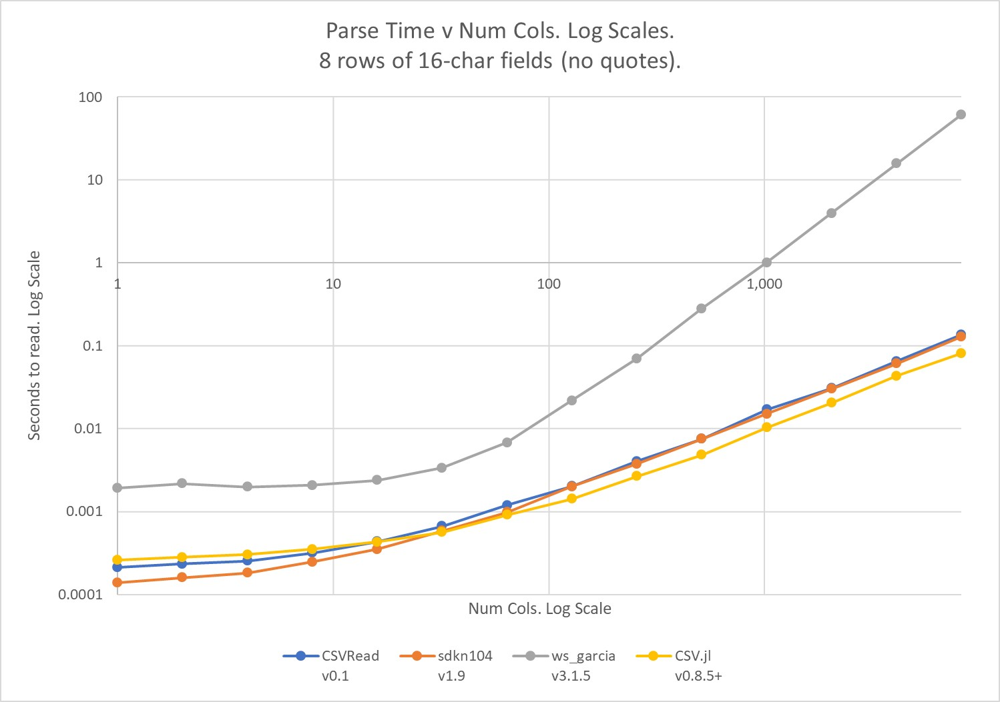
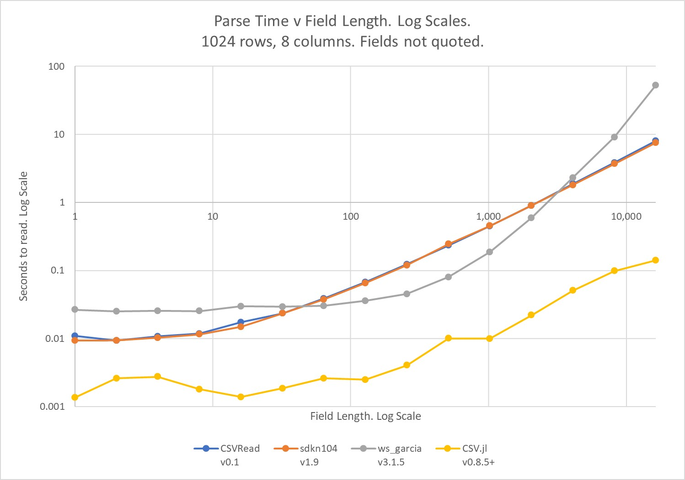

# VBA-CSV
Fast and convenient CSV reading and writing for VBA and Excel spreadsheets, inspired by R's [fread](https://www.rdocumentation.org/packages/data.table/versions/1.14.0/topics/fread), and Julia's [CSV.jl](https://csv.juliadata.org/stable/).

# Contents  
[Installation](#installation)  
[Acknowledgements](#acknowledgements)  
[Examples](#examples)  
[Documentation](#documentation)  
    [CSVRead](#csvread)  
    [CSVWrite](#csvwrite)  
[Errors](#errors)  
[Testing](#testing)  
[Alternatives](#alternatives)  
[Notes](#notes)  
[Performance](#performance)  
[Compatibility](#compatibility)  
[About](#about)  

# Installation
1. Download the [latest release](https://github.com/PGS62/VBA-CSV/releases).
2. Import `modCSVReadWrite.bas` into your project (Open VBA Editor, `Alt + F11`; File > Import File).
3. Add a reference to "Microsoft Scripting Runtime" (In VBA Editor Tools > References).
4. Add a reference to "Microsoft VBScript Regular Expressions 5.5"
5. If you plan to call the functions from spreadsheet formulas then you might like to tell Excel's Function Wizard about them by adding calls to `RegisterCSVRead` and `RegisterCSVWrite` to the project's `Workbook_Open` event, which lives in the `ThisWorkbook` class module.
```vba
Private Sub Workbook_Open()
    RegisterCSVWrite
    RegisterCSVRead
End Sub
```
# Acknowledgements
I re-worked the parsing code of `CSVRead` after examining [sdkn104](https://github.com/sdkn104)'s code available [here](https://github.com/sdkn104/VBA-CSV); my approach is now similar to the one employed there, and the performance is similar too.

The documentation borrows freely from that of Julia's [CSV.jl](https://csv.juliadata.org/stable/), though sadly VBA is not capable of Julia's extremely high performance. More on performance [here](#performance). For testing `CSVRead`, I also use many of the test files that the authors of CSV.jl have created [here](https://github.com/JuliaData/CSV.jl/tree/main/test/testfiles).

# Examples
[Rdatasets](https://vincentarelbundock.github.io/Rdatasets/) provides 1,752 csv files including one containing names of passengers on the Titanic, their sex, age and passenger class, and whether or not they survived the sinking. In this file, missing data is indicated by the two characters `NA`.

To see the data in a worksheet, enter this formula<sup>[1](#myfootnote1)</sup>:
`=CSVRead("https://vincentarelbundock.github.io/Rdatasets/csv/carData/TitanicSurvival.csv",TRUE,,,,,,,,,,,,,"NA",NA())`


To load the data into an array in VBA:
```vba
Sub Demo()
    Dim TitanicData
    TitanicData = CSVRead(FileName:="https://vincentarelbundock.github.io/Rdatasets/csv/carData/TitanicSurvival.csv", _
        ConvertTypes:=True, MissingStrings:="NA")
End Sub
```
-----------------------------
<a name="myfootnote1">Footnote 1</a>: Assumes you're using Excel 365 with its [dynamic array formulas](https://support.microsoft.com/en-us/office/dynamic-array-formulas-and-spilled-array-behavior-205c6b06-03ba-4151-89a1-87a7eb36e531). If you're using an older version of Excel, [this page](https://support.microsoft.com/en-us/office/create-an-array-formula-e43e12e0-afc6-4a12-bc7f-48361075954d) explains how to enter a formula that returns an array.

# Documentation
#### _CSVRead_
Returns the contents of a comma-separated file on disk as an array.
```vba
Public Function CSVRead(FileName As String, Optional ConvertTypes As Variant = False, _
    Optional ByVal Delimiter As Variant, Optional IgnoreRepeated As Boolean, _
    Optional DateFormat As String, Optional Comment As String, _
    Optional IgnoreEmptyLines As Boolean = False, Optional ByVal HeaderRowNum As Long = 0, _
    Optional ByVal SkipToRow As Long = 1, Optional ByVal SkipToCol As Long = 1, _
    Optional ByVal NumRows As Long = 0, Optional ByVal NumCols As Long = 0, _
    Optional TrueStrings As Variant, Optional FalseStrings As Variant, _
    Optional MissingStrings As Variant, Optional ByVal ShowMissingsAs As Variant, _
    Optional ByVal Encoding As Variant, Optional DecimalSeparator As String = vbNullString, _
    Optional ByRef HeaderRow)
```

|Argument|Description|
|:-------|:----------|
|`FileName`|The full name of the file, including the path, or else a URL of a file, or else a string in CSV format.|
|`ConvertTypes`|Controls whether fields in the file are converted to typed values or remain as strings, and sets the treatment of "quoted fields" and space characters.<br/><br/>`ConvertTypes` should be a string of zero or more letters from allowed characters `NDBETQ`.<br/><br/>The most commonly useful letters are:<br/>1) `N` number fields are returned as numbers (Doubles).<br/>2) `D` date fields (that respect `DateFormat`) are returned as Dates.<br/>3) `B` fields matching `TrueStrings` or `FalseStrings` are returned as Booleans.<br/><br/>`ConvertTypes` is optional and defaults to the null string for no type conversion. `TRUE` is equivalent to `NDB` and `FALSE` to the null string.<br/><br/>Three further options are available:<br/>4) `E` fields that match Excel errors are converted to error values. There are fourteen of these, including `#N/A`, `#NAME?`, `#VALUE!` and `#DIV/0!`.<br/>5) `T` leading and trailing spaces are trimmed from fields. In the case of quoted fields, this will not remove spaces between the quotes.<br/>6) `Q` conversion happens for both quoted and unquoted fields; otherwise only unquoted fields are converted.<br/><br/>For most files, correct type conversion can be achieved with `ConvertTypes` as a string which applies for all columns, but type conversion can also be specified on a per-column basis.<br/><br/>Enter an array (or range) with two columns or two rows, column numbers on the left/top and type conversion (subset of `NDBETQ`) on the right/bottom. Instead of column numbers, you can enter strings matching the contents of the header row, and a column number of zero applies to all columns not otherwise referenced.<br/><br/>For convenience when calling from VBA, you can pass an array of two element arrays such as `Array(Array(0,"N"),Array(3,""),Array("Phone",""))` to convert all numbers in a file into numbers in the return except for those in column 3 and in the column(s) headed "Phone".|
|`Delimiter`|By default, `CSVRead` will try to detect a file's delimiter as the first instance of comma, tab, semi-colon, colon or pipe found outside quoted regions in the first 10,000 characters of the file. If it can't auto-detect the delimiter, it will assume comma. If your file includes a different character or string delimiter you should pass that as the `Delimiter` argument.<br/><br/>Alternatively, enter `FALSE` as the delimiter to treat the file as "not a delimited file". In this case the return will mimic how the file would appear in a text editor such as NotePad. The file will be split into lines at all line breaks (irrespective of double quotes) and each element of the return will be a line of the file.|
|`IgnoreRepeated`|Whether delimiters which appear at the start of a line, the end of a line or immediately after another delimiter should be ignored while parsing; useful for fixed-width files with delimiter padding between fields.|
|`DateFormat`|The format of dates in the file such as `Y-M-D`, `M-D-Y` or `Y/M/D`. Also supports `ISO` for [ISO8601](https://en.wikipedia.org/wiki/ISO_8601) (e.g., 2021-08-26T09:11:30) or `ISOZ` (time zone given e.g. 2021-08-26T13:11:30+05:00), in which case dates-with-time are returned in UTC time.|
|`Comment`|Rows that start with this string will be skipped while parsing.|
|`IgnoreEmptyLines`|Whether empty rows/lines in the file should be skipped while parsing (if `FALSE`, each column will be assigned `ShowMissingsAs` for that empty row).|
|`HeaderRowNum`|The row in the file containing headers. Type conversion is not applied to fields in the header row, though leading and trailing spaces are trimmed.<br/><br/>This argument is most useful when calling from VBA, with `SkipToRow` set to one more than `HeaderRowNum`. In that case the function returns the rows starting from `SkipToRow`, and the header row is returned via the by-reference argument `HeaderRow`. Optional and defaults to 0.|
|`SkipToRow`|The first row in the file that's included in the return. Optional and defaults to one more than `HeaderRowNum`.|
|`SkipToCol`|The column in the file at which reading starts. Optional and defaults to 1 to read from the first column.|
|`NumRows`|The number of rows to read from the file. If omitted (or zero), all rows from `SkipToRow` to the end of the file are read.|
|`NumCols`|The number of columns to read from the file. If omitted (or zero), all columns from `SkipToCol` are read.|
|`TrueStrings`|Indicates how `TRUE` values are represented in the file. May be a string, an array of strings or a range containing strings; by default, `TRUE`, `True` and `true` are recognised.|
|`FalseStrings`|Indicates how `FALSE` values are represented in the file. May be a string, an array of strings or a range containing strings; by default, `FALSE`, `False` and `false` are recognised.|
|`MissingStrings`|Indicates how missing values are represented in the file. May be a string, an array of strings or a range containing strings. By default, only an empty field (consecutive delimiters) is considered missing.|
|`ShowMissingsAs`|Fields which are missing in the file (consecutive delimiters) or match one of the `MissingStrings` are returned in the array as `ShowMissingsAs`. Defaults to Empty, but the null string or `#N/A!` error value can be good alternatives.<br/><br/>If `NumRows` is greater than the number of rows in the file then the return is "padded" with the value of `ShowMissingsAs`. Likewise, if `NumCols` is greater than the number of columns in the file.|
|`Encoding`|Allowed entries are `UTF-16`, `UTF-8`, `UTF-8-BOM`, and `ANSI`, but for most files this argument can be omitted and `CSVRead` will detect the file's encoding. If auto-detection does not work then it's possible that the file is encoded `UTF-16` but without a byte option mark, so try entering `Encoding` as `UTF-16`.|
|`DecimalSeparator`|In many places in the world, floating point number decimals are separated with a comma instead of a period (3,14 vs. 3.14). `CSVRead` can correctly parse these numbers by passing in the `DecimalSeparator` as a comma, in which case comma ceases to be a candidate if the parser needs to guess the `Delimiter`.|
|`HeaderRow`|This by-reference argument is for use from VBA (as opposed to from Excel formulas). It is populated with the contents of the header row, with no type conversion, though leading and trailing spaces are removed.|

[source](https://github.com/PGS62/VBA-CSV/blob/2ea08f7756768c4c0782145d4e9fee6ec2f9e042/src/modCSVReadWrite.bas#L41-L507)

#### _CSVWrite_
Creates a comma-separated file on disk containing `Data`. Any existing file of the same name is overwritten. If successful, the function returns `FileName`, otherwise an "error string" (starts with `#`, ends with `!`) describing what went wrong.
```vba
Public Function CSVWrite(ByVal Data As Variant, Optional FileName As String, _
    Optional QuoteAllStrings As Boolean = True, Optional DateFormat As String = "yyyy-mm-dd", _
    Optional ByVal DateTimeFormat As String = "ISO", _
    Optional Delimiter As String = ",", Optional Unicode As Boolean, _
    Optional ByVal EOL As String = "")
```

|Argument|Description|
|:-------|:----------|
|`Data`|An array of data, or an Excel range. Elements may be strings, numbers, dates, Booleans, empty, Excel errors or null values.|
|`FileName`|The full name of the file, including the path. Alternatively, if `FileName` is omitted, then the function returns `Data` converted CSV-style to a string.|
|`QuoteAllStrings`|If `TRUE` (the default) then elements of `Data` that are strings are quoted before being written to file, other elements (Numbers, Booleans, Errors) are not quoted. If `FALSE` then the only elements of `Data` that are quoted are strings containing `Delimiter`, line feed, carriage return or double quote. In all cases, double quotes are escaped by another double quote.|
|`DateFormat`|A format string that determines how dates, including cells formatted as dates, appear in the file. If omitted, defaults to `yyyy-mm-dd`.|
|`DateTimeFormat`|Format for datetimes. Defaults to `ISO` which abbreviates `yyyy-mm-ddThh:mm:ss`. Use `ISOZ` for ISO8601 format with time zone the same as the PC's clock. Use with care, daylight saving may be inconsistent across the datetimes in data.|
|`Delimiter`|The delimiter string, if omitted defaults to a comma. `Delimiter` may have more than one character.|
|`Unicode`|If `FALSE` (the default) the file written will be encoded UTF-8. If TRUE the file written will be encoded UTF-16 LE BOM. An error will result if this argument is `FALSE` but `Data` contains strings with characters whose code points exceed 255.|
|`EOL`|Controls the line endings of the file written. Enter `Windows` (the default), `Unix` or `Mac`. Also supports the line-ending characters themselves (ascii 13 + ascii 10, ascii 10, ascii 13) or the strings `CRLF`, `LF` or `C`. The last line of the file is written with a line ending.|

[source](https://github.com/PGS62/VBA-CSV/blob/2ea08f7756768c4c0782145d4e9fee6ec2f9e042/src/modCSVReadWrite.bas#L2792-L2927)

# Errors
You can call `CSVRead` and `CSVWrite` both from spreadsheets (best with Excel 365 and [dynamic array formulas](https://support.microsoft.com/en-us/office/dynamic-array-formulas-and-spilled-array-behavior-205c6b06-03ba-4151-89a1-87a7eb36e531)) and from VBA. When an error occurs, the functions return a string starting with `#` and ending with `!` which gives an explanation of what went wrong.

So, to get robust error handling from VBA, you should wrap calls to `CSVRead` and `CSVWrite` inside calls to a function `ThrowIfError`:
```vba
FileContents = ThrowIfError(CSVRead("c:\path\filename.csv"))
```
[source](https://github.com/PGS62/VBA-CSV/blob/2ea08f7756768c4c0782145d4e9fee6ec2f9e042/src/modCSVReadWrite.bas#L3082-L3098)

An alternative approach is to change the constant `m_ErrorStyle` (at the top of module `modCSVRead`) from , `es_ReturnString` to `es_RaiseError`, but in that case calls from spreadsheet formulas will return `#VALUE!` if any error happens, with no description provided.

# Testing
`CSVRead` is tested prior to release against a large collection of [test files](https://github.com/PGS62/VBA-CSV/tree/main/testfiles) with comparisons carried out between expected and observed results. You can look at the test code [here](https://github.com/PGS62/VBA-CSV/blob/main/dev/modCSVTest.bas), or run it yourself if you download the [latest version](https://github.com/PGS62/VBA-CSV/releases), open the workbook VBA-CSV.xlsm from the workbooks folder, and click the "Run Tests" button on the "Tests" worksheet. The tests cover almost 100% of the code in modCSVReadWrite.bas.

# Alternatives
Other CSV parsers are available for VBA:  
https://github.com/ws-garcia/VBA-CSV-interface  
https://github.com/sdkn104/VBA-CSV

# Notes
### Line endings
`CSVRead` automatically detects a file's line endings, whether they be Windows-style (`CRLF`), Unix-style (`LF`) or (pre-OSX) Mac (`CR`). Files with mixed line-endings are handled by taking any instance of either `CRLF`, `CR` or `LF` (outside quoted regions) to indicate a line ending.

### Fractional seconds in dates and times
During type conversion, `CSVRead` accepts dates and times where the number of seconds includes a decimal fraction. For example the time`10:13:20.500` is half a second later than the time `10:13:20`. This contrasts with the VBA function [`CDate`](https://docs.microsoft.com/en-us/office/vba/language/concepts/getting-started/type-conversion-functions) where executing
`CDate("10:13:20.500")` results in an error.

### Array Lower Bounds
The return from `CSVRead` is an array with lower bounds of one. If you prefer array lower bounds to be zero, then edit the constant `m_LBound` (at the top of `modCSVReadWrite.bas`) to be 0 rather than 1.  
[source](https://github.com/PGS62/VBA-CSV/blob/2ea08f7756768c4c0782145d4e9fee6ec2f9e042/src/modCSVReadWrite.bas#L32-L33)

### Excel limit on string length
If the `FileName` argument to `CSVWrite` is omitted, then instead of writing a file to disk, the function returns a string in CSV format. But there is a [limit](https://support.microsoft.com/en-us/office/excel-specifications-and-limits-1672b34d-7043-467e-8e27-269d656771c3) on the total number of characters that an Excel cell can contain of 32,767. If the return would otherwise be longer then an error string is returned. This limit does not apply when calling `CSVWrite` from VBA.

# Performance
On a test machine<sup>[2](#myfootnote2)</sup> `CSVRead` parses files at speeds of up to 14Mb per second, so a 140Mb file might take 10 seconds to parse. However, parse time is determined by factors such as the number of rows, number of columns, field length and contents, and the arguments to `CSVRead`, such as whether type conversion is to be carried out.

The workbook VBA-CSV.xlsm in the workbooks folder includes [code](dev/modCSVPerformance.bas) to benchmark `CSVRead` against the two alternative CSV parsers mentioned above and also against [CSV.jl](https://csv.juliadata.org/stable/), a high-performance multi-threaded CSV parser written in [Julia](https://julialang.org/) (so not easily available from VBA). It generates plots of parse time as a function of number of rows, number of columns and field length.

The first plot shows the influence of the number of rows on parsing time. The files examined all had a single column of twenty-character fields with embedded line breaks. Take care interpreting the plot – both axes are on log scale. For the largest file plotted, CSVRead was about 10 times faster than ws_garcia and about 16 times slower than CSV.jl. In this case the file had 1,048,576 rows and was 27.3Mb in size, parse times were: CSVRead 5.2 seconds; ws_garcia 55.8 seconds; and CSV.jl 0.32 seconds.


A second plot shows the influence of the number of columns on parsing time. The files examined all had eight rows and the number of columns varied from 1 to 8,192. All fields were an unquoted 16-character string. The code of ws_garcia can be seen to perform relatively badly on files with a very large number of columns. The largest file in the test had 8,192 columns and was 1.1Mb in size. parse times were: CSVRead 0.13 seconds; ws_garcia 64.4 seconds; and CSV.jl 0.08 seconds.


A third plot shows the influence of field length on parsing time. The files examined all had 1,024 rows and eight columns. In each file, all fields were identical and were the character "x" repeated some number `L` times. `L` varied fom 1 in the first file to 16,384 in the last. This test shows ws_garcia performing best of the three VBA parsers for `L` between 64 and 2,048.

    
The files used to generate the plots above each had every field identical. So for a more realistic measure of comparitive speed we studied the parse times for the 20 largest files provided in [Rdatasets](https://vincentarelbundock.github.io/Rdatasets/). The test code is in [modCSVTestRDatasets.bas](dev/modCSVTestRDatasets.bas) of the workbook VBA-CSV.xlsm. Here are the results, which show `CSVRead` to have very similar speed to sdkn104, and to be about twice as fast as ws_garcia.

|File Name|Size (Mb)|CSVRead<br/>parse time<br/>(seconds)|sdkn104<br/>parse time<br/>(seconds)|ws_garcia<br/>parse time<br/>(seconds)|
|---------|---------|-------------------|------------------|--------------------|
|military.csv|75.8|21.4|20.7|34.1|
|Birthdays.csv|17|5.9|6|10.3|
|wvs_justifbribe.csv|13.9|4.1|4.2|8.2|
|flights.csv|36.7|12|12.7|32.9|
|wvs_immig.csv|12.5|4.1|4.3|7.4|
|Fertility.csv|13.1|4.4|4.7|9.2|
|avandia.csv|6.8|1.7|1.8|2.4|
|AthleteGrad.csv|7|1.6|1.7|2.9|
|mortgages.csv|7.4|2.2|2.3|4.4|
|mammogram.csv|2.2|0.7|0.7|1.1|
|InstEval.csv|3|1|1.1|2|
|gss_abortion.csv|5.4|1.8|1.9|5.2|
|TV16.csv|7.5|2.1|2.1|6.1|
|gss_wages.csv|6|1.4|1.4|2.6|
|CPSSW8.csv|2.6|0.7|0.7|1.1|
|eq_passengercars.csv|7.2|1|1|1.4|
|movies.csv|6.1|2|2.1|7.3|
|diamonds.csv|3.2|1|1.1|2.2|
|gov_transfers_density.csv|1.1|0.3|0.3|0.5|
|seattlepets.csv|4.1|0.9|1|1.4|
|**Total**|**238.6**|**70.4**|**71.6**|**142.8**|

In summary, the performance tests show:
- `CSVRead` and `sdkn104` have very similar parse times.
- `CSVRead` is generally (but not always) faster than `ws_garcia`.
- For realistic structures of input files, such as those provided by Rdatasets, `CSVRead` is about twice as fast as `ws_garcia`. 
- All three VBA parsers are much slower than a parser written in a compiled language such as Julia. If your data files are of GB size, then VBA and Excel might be the wrong tool for the job.

--------------------------------
<a name="myfootnote2">Footnote 2</a>: Surface Book 2, Intel(R) Core(TM) i7-8650U CPU @ 1.90GHz 2.11 GHz, 16GB RAM

# Compatibility
VBA-CSV works only on Windows, not Mac (since Scripting Runtime is not available), and not iOS or Android (since VBA is not available). It has been tested on Excel 365, both 64-bit and 32-bit. It _should_ work on earlier versions of Office but has not yet been tested on them.

# About
Author: Philip Swannell  
Licence: MIT

